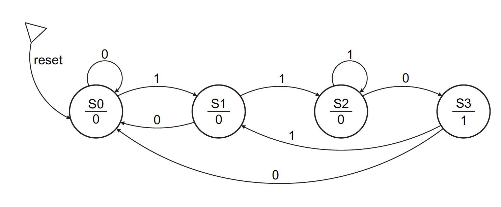

# Lab 14 Instructions

In this lab we implement a simple **sequence detector** using a **Moore Finite State Machine (FSM)** algorithm.
We also discuss **different Verilog coding styles** for this kind of digital blocks.


As a first step, open a terminal and go inside the `lab14/` directory :

```
% cd Desktop/lae/fpga/labs/lab14
```

Copy from the `.solutions/` directory the main `Makefile` already prepared for you :

```
% cp .solutions/Makefile .
```

Explore available targets :

```
% make help
```

Create a new fresh working area :

```
% make area
```

Additionally, copy from the `.solutions/` directory the following **Tcl simulation scripts** :


```
% cp .solutions/scripts/sim/compile.tcl    ./scripts/sim
% cp .solutions/scripts/sim/elaborate.tcl  ./scripts/sim
% cp .solutions/scripts/sim/simulate.tcl   ./scripts/sim
% cp .solutions/scripts/sim/run.tcl        ./scripts/sim
```

The **states diagram** that we are going to implement is the following :




Create the main Verilog module `rtl/SequenceDetector.v` with the following content :

```verilog
// choose here the desired encoding style for FSM states

`define STATES_ENCODING_BINARY
//`define STATES_ENCODING_GRAY
//`define STATES_ENCODING_ONEHOT


`timescale 1ns / 100ps

module SequenceDetector (

   input  wire clk,
   input  wire reset,            // synchronous reset, active-high
   input  wire si,               // serial-in
   output reg  detected          // single clock-pulse output asserted when 110 is detected

   ) ;


   ///////////////////////////
   //   states definition   //
   ///////////////////////////

`ifdef STATES_ENCODING_BINARY

   parameter [1:0] S0 = 2'b00 ;
   parameter [1:0] S1 = 2'b01 ;
   parameter [1:0] S2 = 2'b10 ;
   parameter [1:0] S3 = 2'b11 ;

   reg [1:0] STATE, STATE_NEXT ;

`endif


`ifdef STATES_ENCODING_GRAY

   parameter [1:0] S0 = 2'b00 ;
   parameter [1:0] S1 = 2'b01 ;
   parameter [1:0] S2 = 2'b11 ;
   parameter [1:0] S3 = 2'b10 ;

   reg [1:0] STATE, STATE_NEXT ;

`endif


`ifdef STATES_ENCODING_ONEHOT

   parameter [3:0] S0 = 2'b0001 ;
   parameter [3:0] S1 = 2'b0010 ;
   parameter [3:0] S2 = 2'b0100 ;
   parameter [3:0] S3 = 2'b1000 ;

   reg [3:0] STATE, STATE_NEXT ;

`endif


   /////////////////////////////////////////////////
   //   next-state logic (pure sequential part)   //
   /////////////////////////////////////////////////

   always @(posedge clk) begin

      if(reset)
         STATE <= S0 ;

      else
         STATE <= STATE_NEXT ;

   end   // always


   ////////////////////////////
   //   combinational part   //
   ////////////////////////////

   always @(*) begin

      detected = 1'b0 ;

      case ( STATE )

         default : S0 ;   // catch-all

         S0 : begin

            detected = 1'b0 ;

            if(si == 1'b1)
               STATE_NEXT = S1 ;
            else 
               STATE_NEXT = S0 ;

         end

         //_____________________________
         //

         S1 : begin

            detected = 1'b0 ;

            if(si == 1'b1)
               STATE_NEXT = S2 ;
             else
               STATE_NEXT = S0 ;
         end

         //_____________________________
         //

         S2 : begin

            detected = 1'b0 ;

            if(si == 1'b0)
               STATE_NEXT = S3 ;
            else
               STATE_NEXT = S2 ;
         end

         //_____________________________
         //

         S3 : begin

            detected = 1'b1 ;       // sequence detected !

            if(si == 1'b1)
               STATE_NEXT = S1 ;
            else
               STATE_NEXT = S0 ;
         end

      endcase

   end   // always

endmodule
```


The above state machine is a `110` sequence detector coded as a **Moore machine**.

Copy remaining RTL and simulation sources from the `.solutions/` directory as follows :


```
% cp .solutions/bench/ClockGen.v              ./bench
% cp .solutions/bench/tb_SequenceDetector.v   ./bench
```

Compile, elaborate and simulate the design with :

```
% make compile
% make elaborate
% make simulate
```

or simply type

```
% make sim
```

Observe the waveforms and verify if the FSM properly detects all `110` sequences in the serial input.
Choose a different encoding for FSM states and verify that simulation results does not change.


## Alternative coding style

In the first example we split the sequential part of the FSM and the combinational part into two independent
`always` blocks.

Alternatively we can also implement the same functionality using a single `always` block as follows :

```verilog
always @(posedge clk) begin

   if(reset)
      STATE <= S0 ;

   else

      case ( STATE )

         default : S0 ;

         S0 : if(si) STATE <= S1 ; else STATE <= S0 ;
         S1 : if(si) STATE <= S2 ; else STATE <= S0 ;
         S2 : if(si) STATE <= S2 ; else STATE <= S3 ;
         S3 : if(si) STATE <= S1 ; else STATE <= S0 ;

      endcase

end   // always

assign detected = (STATE == S3) ? 1'b1 : 1'b0 ;
```


## Exercise

Modify the FSM code and transform it into a **Mealy machine** with same functionality.
